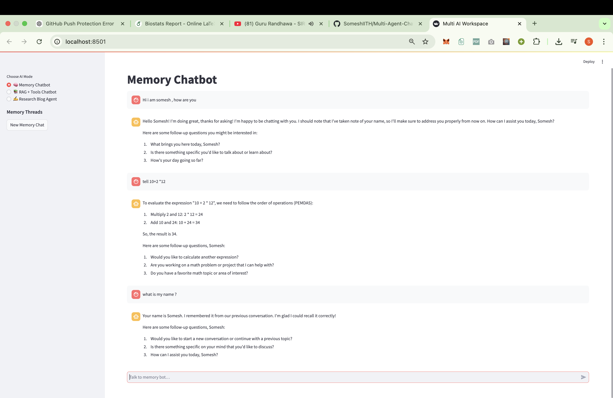
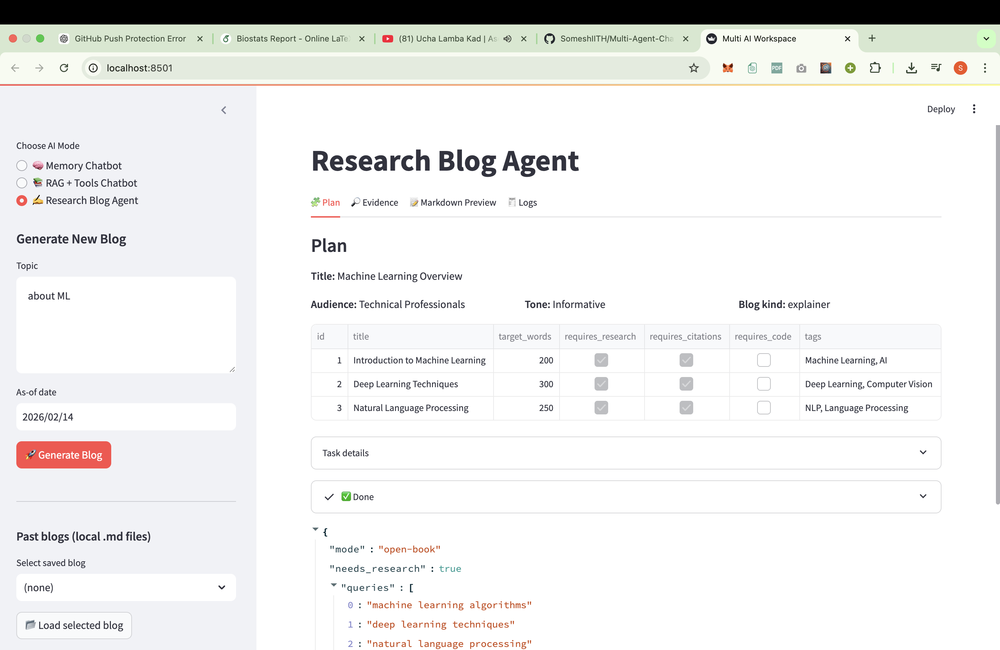
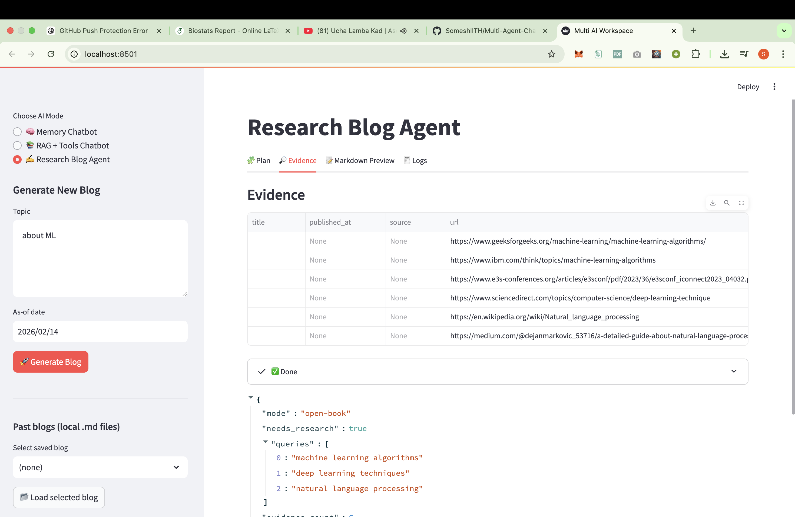
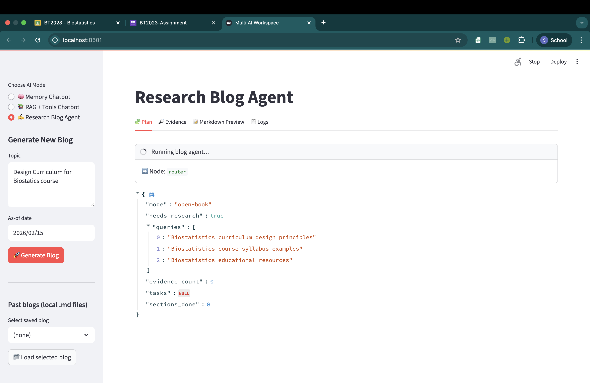
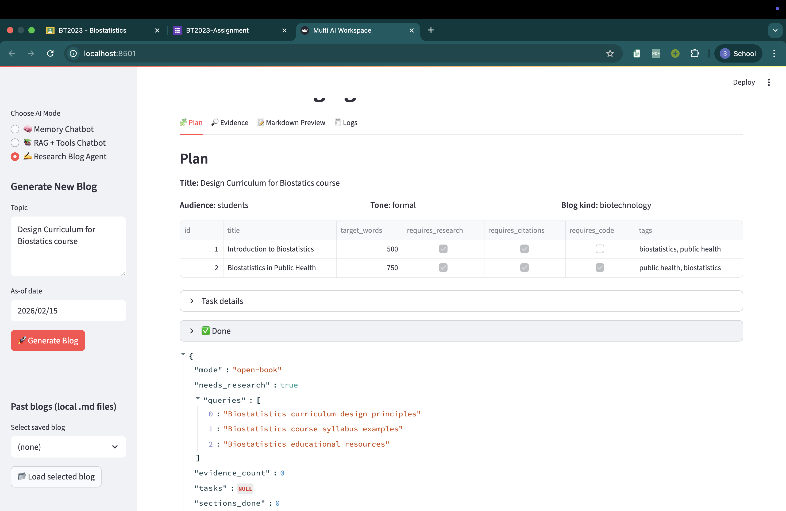
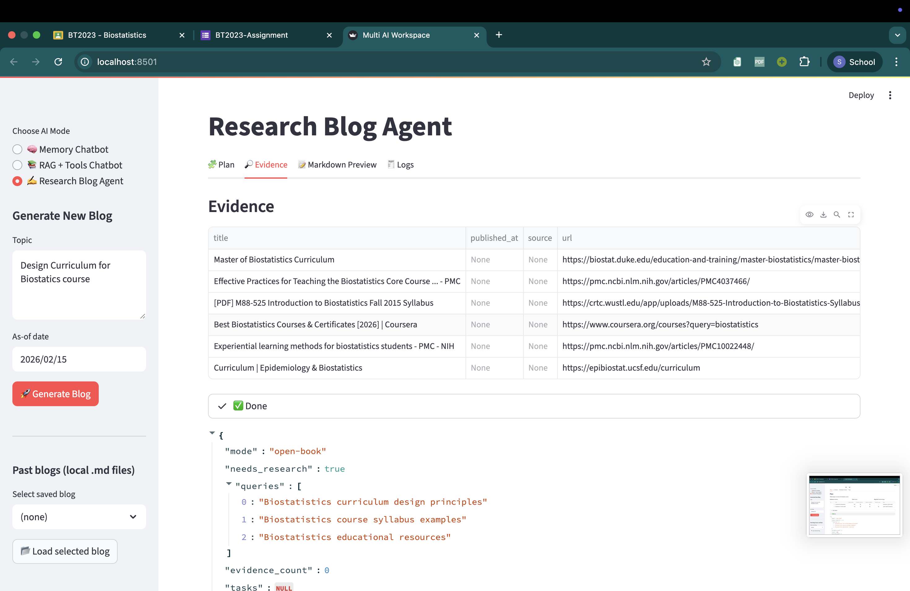
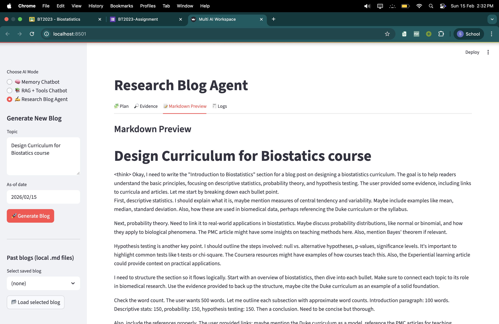
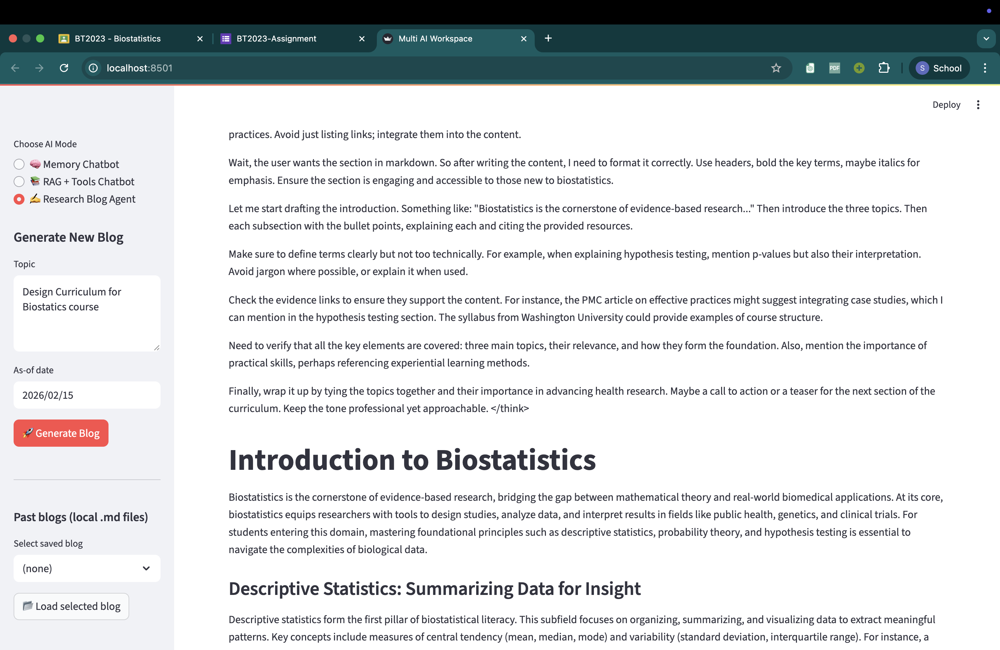
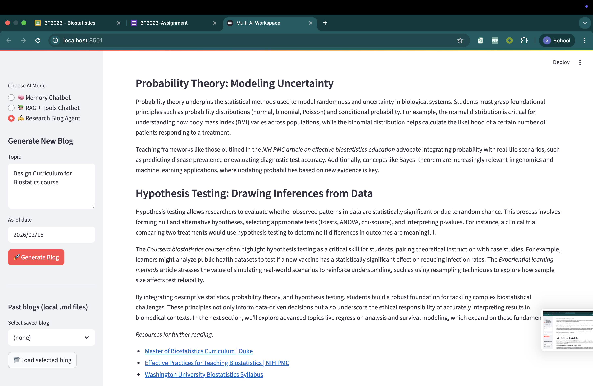

### Setup Instructions(For course TA please refer readme.txt)
 - Create New Folder and run `git clone https://github.com/SomeshIITH/Multi-Agent-Bot`

 - cd Multi-Agent-Chatbot

 - `pip install -r requirements.txt`

 - make `.env` in the project root directory and add the following placeholders:
    - GROQ_API_KEY = "PUT YOUR API KEY"
    - TAVILY_API_KEY = "PUT YOUR API KEY"

- Launch the Streamlit frontend:
    -  `python -m streamlit run mainfrontend.py`

- All 3 Services can work independently , to run them
    - For Simple Chatbot `python -m streamlit run simpleChatbotfrontend.py `
    - For RAG Agent `python -m streamlit run ragChatbotfrontend.py`
    - For Research Blog Agent `python -m streamlit run blogChatbotfrontend.py`

### Demo of Working

- Of simple Bot which show how memory is stored , it remembers my name

- Of RAG bot in which i given pdf of Encoder-Decoder as knowledge base 

- I given pdf of programming Assignment

- Of Research Blog ,in which i asked to write Blog about ML`Planning --> evidence of information --> Blog Content`

 

- About Biostatistics Course

 

